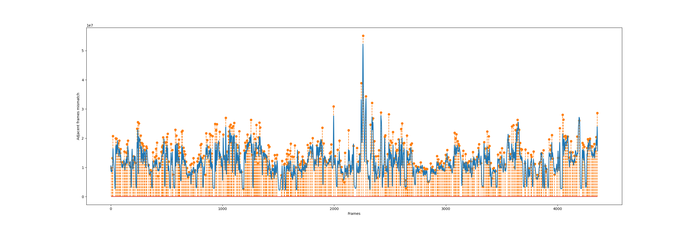

# Key Frames Extraction
This project implements python script to read a video or image folder and extract key frames to txt files based on sum of absolute differences in LUV colorspace.

## Getting Started
Download or clone this repository to your local system.
### Prerequisites
You need to have OpenCV and Python installed on your machine.For OpenCV look for another one of my repsitory. 
### How to Run...
Download this project to your machine.
Move to the folder using
```
cd KeyFramesExtraction
python scene_div.py -p <videodir|folderdir> -o <extract frames to this dir> -m <mode> -v <mode value> --plot
```
### Results
The following figure shows the result of keyframe extraction, with each dotted line representing a keyframe.


